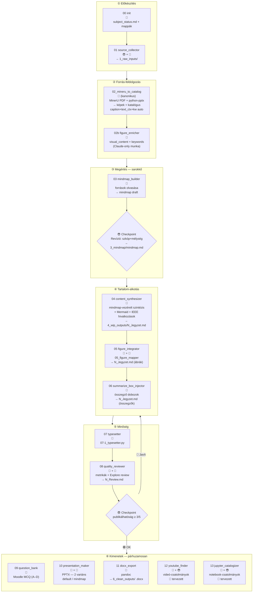

---
title: Pipeline.md — claude_course
type: meta
status: active
version: 1.6
updated: 2026-06-04
description: Claude-natív tananyagfejlesztési pipeline, NotebookLM mentesen.
---

# PIPELINE.MD — claude_course

## 1. A tradicionális oktató → Claude leképezés

| Oktató | Claude-pipeline |
|--------|-----------------|
| Célcsoport, tanterv | `00_init` — subject_status.md |
| Anyaggyűjtés | `01_source_collector` |
| Olvas → megért → szintetizál | `02_image_extraction` + `03_mindmap_builder` |
| **Elmetérkép** | **03 kimenet: mindmap** (😎 revideálja) |
| Word: ír, hivatkozik, képek, egyenletek, táblázatok, diagrammok | `04_content_synthesizer` + `05_figure_integrator` + `06_summarize_box_injector` |
| Word → PowerPoint | `10_presentation_maker` |
| Vizsgakérdések (Moodle MCQ) | `09_question_bank` |
| Youtube search | 🔲 tervezett `12_youtube_finder` |
| Jupyter notebook | 🔲 tervezett `13_jupyter_catalogizer` |
[ ] Youtube, Jupyter már folyamatban. De a fő kérdés, hogy miért nem írodott át itt a pipeline?

**Kulcselv:** → [Instructions.md §2](../Instructions.md)

[ ] Ha felfelé hivatkozunk az miért kell?

[ ] Fő feladat, hogy egy tényleges call_graph-ot kapjunk, hogy lássuk mennyire egyezik a fenti "tervezett" szekvenciális elképzeléssel. Én úgy érzem, hogy a legtöbb ponton felül kell vizsálni az állomásokat, de vannak olyan pontok ahol például egyértelműen én jelölök ki anyagokat/bekezdéseket (pl youtube, jupyter) te legyártod, és visszafelé felveszed a wip és clean jegyzetekbe. VAGY addig a wip-ben maradunk, amíg már minden kész nincs tartalmilag és csak utána megyünk a camera-ready státusz-ba, aminek elv szerint színtiszta konverziónak és template használatnak kéne lennie. Ebben az esetben 5_asset_outputs és 6_clean_outputs lenne a helyes mappastruktúra.

## 2. Lépések és IO

| Input | Felelős | Lépés | Automatizáltság | Output |
|:------|:--------|:------|:----------------|:-------|
| Célcsoport, hetek, tantárgy | 😎 | [`00_init`](skills/00_init.md) — `00_init_course.py` | 🐍 | `subject_status.md` + mappák |
| URL-ek, PDF-ek, PPTX-ek | 😎+🤖 | [`01_source_collector`](skills/01_source_collector.md) | 🤖+😎 | `1_raw_inputs/` + `citations.json` |
| `1_raw_inputs/` | 🐍 | `02_mineru_to_catalog` — `scripts/02_mineru_to_catalog.py` (MinerU + PPTX) **standard** | 🐍 | `2_clean_inputs/` képek + `figure_catalog.json` (v4, caption+text_context+keywords előtöltve) |
| `1_raw_inputs/` | 🐍 | [`02_image_extraction`](skills/02_image_extraction.md) — `02_mineru_to_catalog.py` (MinerU, conda `mineru` env); caption+text_context+keywords-draft gépi | 🐍 | `2_clean_inputs/` képek + `figure_catalog.json` (v4) |
| `2_clean_inputs/figure_catalog.json` | 🤖 | [`02b_figure_enricher`](skills/02b_figure_enricher.md) — `visual_content` + `keywords` finomítás (csak ez marad Claude-ra) | 🤖 | ugyanaz, `visual_content` + végleges `keywords` kitöltve |
| `2_clean_inputs/` | 🤖 | [`03_mindmap_builder`](skills/03_mindmap_builder.md) — olvas, szintetizál | 🤖 🚦😎 | `3_mindmap/mindmap.md` (flowchart LR) |
| `3_mindmap/mindmap.md` | 🤖 | [`04_content_synthesizer`](skills/04_content_synthesizer.md) — mindmap-vezérelt szintézis | 🤖 🚦 | `4_wip_outputs/N_Jegyzet.md` |
| `4_wip_outputs/N_Jegyzet.md` | 🤖+🐍 | [`05_figure_integrator`](skills/05_figure_integrator.md) — `05_figure_mapper.py` | 🤖+🐍 | `4_wip_outputs/N_Jegyzet.md` (ábrák) |
| `4_wip_outputs/N_Jegyzet.md` | 🤖 | [`06_summarize_box_injector`](skills/06_summarize_box_injector.md) — összegző dobozok | 🤖 | `4_wip_outputs/N_Jegyzet.md` (összegzők) |
| `4_wip_outputs/N_Jegyzet.md` | 🐍 | [`07_typesetter`](skills/07_typesetter.md) — `07-1_typesetter.py` + `07-2_heading_numberer.py` + `07-3_figure_numberer.py` | 🐍 | `4_wip_outputs/N_Jegyzet.md` (lint + fejezet/ábra-számozás) |
| `4_wip_outputs/N_Jegyzet.md` | 🐍+🤖 | [`08_quality_reviewer`](skills/08_quality_reviewer.md) — `08_quality_check.py` | 🐍+🤖 🚦😎 | `4_wip_outputs/N_Review.md` |
| `4_wip_outputs/N_Jegyzet.md` | 🤖 | [`09_question_bank`](skills/09_question_bank.md) — mindmap-alapú MCQ | 🤖 | `4_wip_outputs/N_Kerdesbank.md` |
| `4_wip_outputs/N_Jegyzet.md` | 🤖+🐍 | [`10_presentation_maker`](skills/10_presentation_maker.md) — tartalmi Mermaid→PNG (`10-1_mermaid_render.py`) + navigáció-injektálás (`10-2_nav_inject.py`) + `.potx`-natív PPTX (`10_pptx_gyarto.py --variant`). Két variáns: **default** (fejléc-breadcrumb) / **mindmap** (oldalsáv-TOC), közös navigációs modellből (`_nav_util.py`); a PPTX a `.potx` mesterekből (Garamond cím + Aptos body) készül, valódi táblákkal és LaTeX→PNG képletekkel | 🤖+🐍 | `4_wip_outputs/N_Prezentacio.md` (+ `_default`/`_mindmap`) + `5_clean_outputs/N_Prezentacio.pptx` (+ `_mindmap`) |
| `4_wip_outputs/N_Jegyzet.md` | 🐍 | [`11_docx_export`](skills/11_docx_export.md) — pandoc (`11-2`) | 🐍 | `6_clean_outputs/N_Jegyzet.docx` |
| `4_wip_outputs/N_Jegyzet.md` (+ `N_Prezentacio.md`) | 🤖+😎 | [`12_youtube_finder`](skills/12_youtube_finder.md) — videó-csatolmányok 🔲 *tervezett* | 🤖+😎 | videó-katalógus + csatolmány-jelölés |
| `4_wip_outputs/N_Jegyzet.md` (+ `N_Prezentacio.md`) | 🤖+😎 | [`13_jupyter_catalogizer`](skills/13_jupyter_catalogizer.md) — notebook-csatolmányok 🔲 *tervezett* | 🤖+😎 | notebook-katalógus + csatolmány-jelölés |

## 2.1 Vizualizáció



## 3. Checkpointok

| Checkpoint | Feltétel | Következő lépés |
|:-----------|:---------|:----------------|
| 03 után 🚦 | Mindmap revideálva, szkóp+mélység metszés kész, struktúra jóváhagyva | 04 content_synthesizer |
| 08 után 🚦 | Publikálhatóság ≥ 3/5, N_Review.md jóváhagyva | 09 + 10 + 11 (opc. 12, 13) párhuzamosan |

A 08-checkpointon a 😎 a PUBLIKÁLHATÓ döntés ellenére is kérhet **célzott revíziót** (a Review
`## 6` csatornáján, [08 §3.5](skills/08_quality_reviewer.md)). Forrás-stratégia szerinti routing:
**meglévő forrás** → vissza 04-hez; **új forrás** → vissza 01 → 02 → 04. A revízió után 07 → 08 újrafut.

## 4. Vizuális gazdagítás
TODO Ezeket is már említettük upstream. Nem tudom, hogyha ez a bekezdés nincs itt, akkor nem lépne életbe a jelen bekezdés tartalma?

A kötelező vizuális rétegek és a diagram-típus döntési fa kanonikus helye: [Instructions.md §7](../Instructions.md). A pipeline-ban ezt a `04 content_synthesizer`, `05 figure_integrator` (ábrák, `figure_catalog.json` alapján) és `06 summarize_box_injector` lépések valósítják meg — utóbbi minden `##` alfejezet végére `💡 Összegzés`, minden `#` fejezet zárásánál `🗺️ Fejezet összegfoglalása` blokkot illeszt (formátum: [skills/06_summarize_box_injector.md](skills/06_summarize_box_injector.md) §3).

## 5. Mappastruktúra
TODO ezt itt kell dokumentálni?

→ Kanonikus mappastruktúra: [Instructions.md §6](../Instructions.md).

## 6. Citáció-rendszer

TODO ezt itt kell dokumentálni?

```json
// 1_raw_inputs/citations.json — fájlnév-alapú, IEEE-kompatibilis
{
  "_meta": {"subject": "...", "week": 1},
  "1": {"type": "book", "author": "...", "title": "...", "year": "...", "venue": "...", "filename": "gravdahl1999_book.pdf", "original_filename": "D6 kieg - gravdahl1999-Book-….pdf"},
  "2": {"type": "webpage", "author": "...", "title": "...", "year": "...", "url": "...", "filename": "wikipedia2024_webpage.pdf", "original_filename": "https://…"}
}
```

- A kulcs (`"1"`, `"2"`) megegyezik a szövegbeli `[1]`, `[2]` jelöléssel.
- `filename` = konvenciós név; `original_filename` = provenance (nem kerül a kész outputba).
- Hivatkozási formátum (IEEE, `type`-alapú) és a `## Hivatkozásjegyzék` kötelezettség: [Instructions.md §8](../Instructions.md).
- Generálás: `_ieee_renderer.py` (a `1_raw_inputs/citations.json`-ból).

## 7. Agent architektúra

TODO: ez itt inkább egy human-in-the-loop és Agent architektúra, csak nem világos hogy ezeket miért nevezed agent-nek.

TODO: Tulajdonképpen minden lépés után meg kell néznem az eredményeket.

TODO: 12 és 13 szinte biztos nem automatikusak. Gyakorlatilag nekem kell kijelölni, hogy mihez keress videókat és mihez gyárts notebook-ok.

TODO: Erősen kételkedem, hogy itt lesznek párhuzamos lépések. 

| Típus | Lépések | Indok |
|-------|---------|-------|
| Szekvenciális (foreground) | 02→03→04→05→06→07→08 | Output-függőség; checkpointok |
| Párhuzamos (background) | 09 ‖ 10 ‖ 11 (‖ 12 ‖ 13) | Független outputok |
| Interaktív (inline) | 03 checkpoint, 08 checkpoint | Emberi döntés szükséges |

Az agent-prompt minden skill esetén a skill `§3 Eljárás` szekciója alapján generálódik.

## 8. Nyitott pontok

→ Backlog kezelése: [project_status.md](project_status.md).

## Változásjegyzék

TODO: a változásjegyzék miért össze-vissza frissül? legyen a legfrissebb változás legalul és legyen ez konvenció, amit vagy itt vagy fentebb rögzítesz (Ezt nem biztos, hogy itt kell rögzíteni, csak itt vettem észre.)

| Dátum | Verzió | Leírás |
|-------|--------|--------|
| 2026-06-01 | 1.0 | Létrehozva (claude_play archív alapján, NLM-mentes) |
| 2026-06-02 | 1.1 | Mermaid vertikalizálva + `<br>` sortörés-javítás; D1/D2 deduplikáció (vizuális → Instructions §7, IEEE → §8); 05 script a táblába |
| 2026-06-03 | 1.2 | 05 szétválasztva: 05_figure_integrator + 06_summarize_box_injector; 06–10 lépések +1 átszámozva (→ 07–11), scriptek párhuzamosan; 12_youtube_finder + 13_jupyter_catalogizer beillesztve a kimeneti fázisba |
| 2026-06-03 | 1.3 | §4: 06 kimenete `📦 Összegző` (egyszintű) → kétszintű (`💡 Összegzés` per `##` + `🗺️ Fejezet összegfoglalása` per `#`) |
| 2026-06-05 | 1.6 | **MinerU-first pipeline**: `02_mineru_to_catalog.py` a standard 02 lépés (caption+text_context+keywords draft gépileg auto-kitöltve MinerU _content_list.json-ból); `02_image_extraction.py` fallback marad. `02b_figure_enricher` csak `visual_content` + keywords finomítás = Claude-only minimális munka. Sprint: [ocr_lab/decision.md](sprints/image_rag/ocr_lab/decision.md). |
| 2026-06-05 | 1.5 | **image_rag_OCR sprint**: 02c_mineru_layout opcionális lépés (MinerU layout/formula/képpárosítás) `02 → 02c → 02b` chain-ben. 02b_figure_enricher v1.1: backend-preferencia chain (MinerU > PyMuPDF4LLM > Tesseract > Claude Read). Komparatív kutatás: [.claude/sprints/image_rag/ocr_lab/decision.md](sprints/image_rag/ocr_lab/decision.md). |
| 2026-06-04 | 1.4 | **image_rag sprint (Block 8)**: 02b_figure_enricher beillesztve a 02 és 03 közé; `figure_catalog.json` séma v4 (`_meta + sources` csoportosítva, 11 mező logikus sorrendben, `_status` derived flag, `_usage.example_entry` self-documenting); egységes `pNNN_figNNN.png` naming-konvenció; OCR-cache szkennelt PDF-ekhez. Sprint plan: [.claude/sprints/image_rag/image_rag_plan.md](sprints/image_rag/image_rag_plan.md) |
