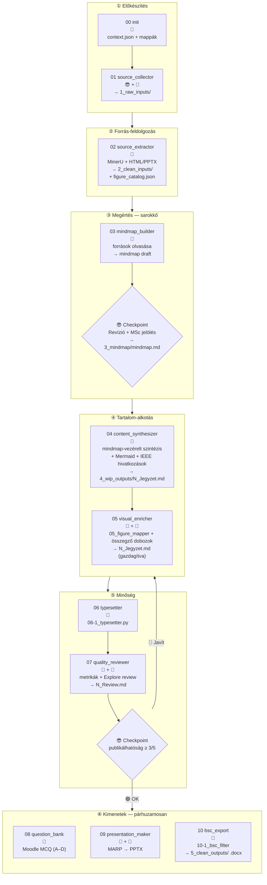

# PIPELINE.MD — claude_course

## 1. A tradicionális oktató → Claude leképezés

| Oktató | Claude-pipeline |
|--------|-----------------|
| Célcsoport, tanterv | `00_init` — context.json |
| Anyaggyűjtés | `01_source_collector` |
| Olvas → megért → szintetizál | `02_source_extractor` + `03_mindmap_builder` |
| **Elmetérkép** | **03 kimenet: mindmap** (😎 revideálja) |
| Word: ír, hivatkozik, képek, egyenletek | `04_content_synthesizer` |
| Word → PowerPoint | `09_presentation_maker` |
| Vizsgakérdések (Moodle MCQ) | `08_question_bank` |
| Jupyter notebook | 🔲 jövőbeni `11_notebook_maker` |

**Kulcselv:** → [Instructions.md §2](../Instructions.md)

## 2. Lépések és IO

| Input | Felelős | Lépés | Automatizáltság | Output |
|:------|:--------|:------|:----------------|:-------|
| Célcsoport, hetek, tantárgy | 😎 | [`00_init`](skills/00_init.md) — `00_init_course.py` | 🐍 | `context.json` + mappák |
| URL-ek, PDF-ek, PPTX-ek | 😎+🤖 | [`01_source_collector`](skills/01_source_collector.md) | 🤖+😎 | `1_raw_inputs/` + `citations_seed.json` |
| `1_raw_inputs/` | 🐍 | [`02_source_extractor`](skills/02_source_extractor.md) — MinerU + HTML/PPTX | 🐍 | `2_clean_inputs/` + `figure_catalog.json` |
| `2_clean_inputs/` | 🤖 | [`03_mindmap_builder`](skills/03_mindmap_builder.md) — olvas, szintetizál | 🤖 🚦😎 | `3_mindmap/mindmap.md` (flowchart LR) |
| `3_mindmap/mindmap.md` | 🤖 | [`04_content_synthesizer`](skills/04_content_synthesizer.md) — mindmap-vezérelt szintézis | 🤖 🚦 | `4_wip_outputs/N_Jegyzet.md` |
| `4_wip_outputs/N_Jegyzet.md` | 🤖+🐍 | [`05_visual_enricher`](skills/05_visual_enricher.md) — `05_figure_mapper.py` + összegzők | 🤖+🐍 | `4_wip_outputs/N_Jegyzet.md` (gazdagítva) |
| `4_wip_outputs/N_Jegyzet.md` | 🐍 | `06-1_typesetter.py` | 🐍 | `4_wip_outputs/N_Jegyzet.md` (lint) |
| `4_wip_outputs/N_Jegyzet.md` | 🐍+🤖 | [`07_quality_reviewer`](skills/07_quality_reviewer.md) — `07_quality_check.py` | 🐍+🤖 🚦😎 | `4_wip_outputs/N_Review.md` |
| `4_wip_outputs/N_Jegyzet.md` | 🤖 | [`08_question_bank`](skills/08_question_bank.md) — mindmap-alapú MCQ | 🤖 | `4_wip_outputs/N_Kerdesbank.md` |
| `4_wip_outputs/N_Jegyzet.md` | 🤖+🐍 | [`09_presentation_maker`](skills/09_presentation_maker.md) — MARP → PPTX | 🤖+🐍 | `4_wip_outputs/N_Prezentacio.md` + `5_clean_outputs/N_Prezentacio.pptx` |
| `4_wip_outputs/N_Jegyzet.md` | 🐍 | [`10_bsc_export`](skills/10_bsc_export.md) — `10-1_bsc_filter.py` + pandoc | 🐍 | `5_clean_outputs/N_Jegyzet[_bsc].docx` |

## 2.1 Vizualizáció



## 3. Checkpointok

| Checkpoint | Feltétel | Következő lépés |
|:-----------|:---------|:----------------|
| 03 után 🚦 | Mindmap revideálva, [MSc] jelölés kész, struktúra jóváhagyva | 04 content_synthesizer |
| 07 után 🚦 | Publikálhatóság ≥ 3/5, N_Review.md jóváhagyva | 08 + 09 + 10 párhuzamosan |

## 4. Vizuális gazdagítás

A kötelező vizuális rétegek és a diagram-típus döntési fa kanonikus helye: [Instructions.md §7](../Instructions.md). A pipeline-ban ezt a `04 content_synthesizer` és `05 visual_enricher` lépések valósítják meg, az `figure_catalog.json` alapján.

## 5. Mappastruktúra

→ Kanonikus mappastruktúra: [Instructions.md §6](../Instructions.md).

## 6. Citáció-rendszer

```json
// citations.json — fájlnév-alapú, IEEE-kompatibilis
{
  "_meta": {"subject": "...", "week": 1},
  "1": {"author": "...", "title": "...", "year": "...", "filename": "...", "pages": "..."},
  "2": {"author": "...", "title": "...", "url": "...", "accessed": "2026-06-01"}
}
```

- Hivatkozási formátum (IEEE), `[S1]` jelölés és a `## Hivatkozásjegyzék` kötelezettség: [Instructions.md §8](../Instructions.md).
- Generálás: `_ieee_renderer.py` (fájlnév-alapú lookup).

## 7. Agent architektúra

| Típus | Lépések | Indok |
|-------|---------|-------|
| Szekvenciális (foreground) | 02→03→04→05→06→07 | Output-függőség; checkpointok |
| Párhuzamos (background) | 08 ‖ 09 ‖ 10 | Független outputok |
| Interaktív (inline) | 03 checkpoint, 07 checkpoint | Emberi döntés szükséges |

Az agent-prompt minden skill esetén a skill `§3 Eljárás` szekciója alapján generálódik.

## 8. Nyitott pontok

→ Backlog kezelése: [project_status.md](project_status.md).

## Változásjegyzék

| Dátum | Verzió | Leírás |
|-------|--------|--------|
| 2026-06-01 | 1.0 | Létrehozva (claude_play archív alapján, NLM-mentes) |
| 2026-06-02 | 1.1 | Mermaid vertikalizálva + `<br>` sortörés-javítás; D1/D2 deduplikáció (vizuális → Instructions §7, IEEE → §8); 05 script a táblába |
