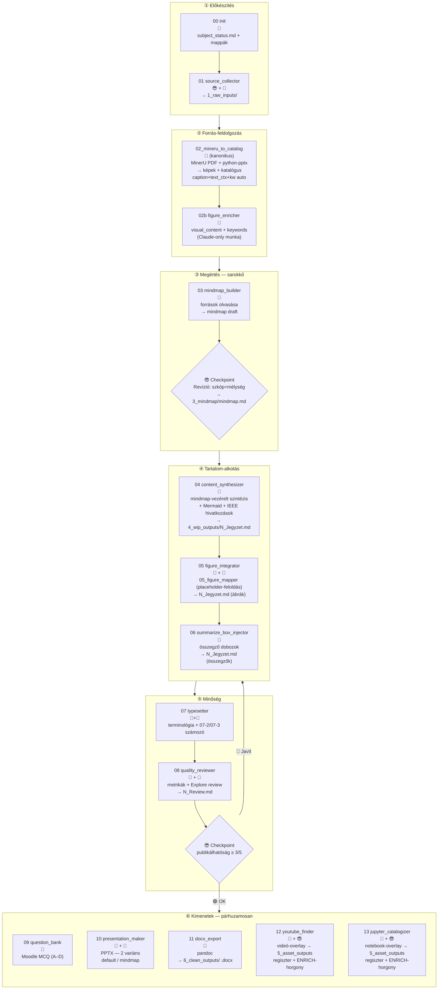

---
title: Pipeline.md — claude_course
type: meta
status: active
version: 2.0
updated: 2026-06-12
description: Claude-natív tananyagfejlesztési pipeline, NotebookLM mentesen.
---

# PIPELINE.MD — claude_course

## 0. Hogyan működik az egész? (amatőr-áttekintés)

Ez **nem** egy „indítsd el és gyere vissza a késztermékért" batch-folyamat. **Interaktív,
ember-felügyelt szerzői hurok**: a 😎 (te, az oktató) irányítasz, a 🤖 (Claude) végzi a
szellemi gyártás zömét, a 🐍 (scriptek) a determinisztikus, megbízható átalakításokat.

A fonal egyszerű nyelven, egy héten belül:

1. **Beállítás** (00–01): megadod a tárgyat/heteket; forrásokat gyűjtesz (PDF/URL/PPTX).
2. **Feldolgozás** (02–02b): a MinerU kinyeri a képeket + felépíti az ábra-katalógust; Claude
   leírja, mit ábrázolnak a képek.
3. **🚦 GATE 1 — elmetérkép** (03): Claude megérti az anyagot és **elmetérképet** rajzol. **Te
   birtoklod**: eldöntöd a szkópot és a mélységet. Ez a legfontosabb sarokkő.
4. **Megírás** (04–06): a mindmap vezérletével Claude megírja a jegyzetet, beilleszti az ábrákat
   és az összegző dobozokat.
5. **Tördelés** (07): terminológia-egységesítés + determinisztikus fejezet/ábra-számozás.
6. **🚦 GATE 2 — publikálhatóság** (08): minőség-ellenőrzés. **Te döntesz**: publikálható, vagy
   célzott revíziót kérsz (vissza 04-re, új forrásnál 01-re).
7. **Kimenetek** (09–11): kérdésbank, prezentáció (PPTX), camera-ready DOCX — a véglegesített
   wip **tiszta konverziója** a `6_clean_outputs/`-ba.
8. **Gazdagítás** (12–13, opcionális): te koncepciókat jelölsz ki, Claude videót/notebookot rendel
   hozzá; ezek **overlay-ként** a `5_asset_outputs/` regiszterbe kerülnek (lásd 12/13 §3.2).

### A te szerepeid (human-in-the-loop)

| 😎-szerep | Hol | Mit csinálsz |
|-----------|-----|--------------|
| **Setup** | 00, 01 | tárgy/hetek/célok; forrás-válogatás (több jelölt), saját fájl, zárt hozzáférés letöltése |
| **Spot-check** | 02/02b, 04, 05, 06, 07 | ránézel az eredményre — könnyű felügyelet, nem gate |
| **🚦 GATE 1 — mindmap** | 03 után | **birtoklod az elmetérképet**: szkóp, mélység, mit metsz |
| **🚦 GATE 2 — publikálhatóság** | 08 után | publikálsz/visszaküldesz; célzott revíziót injektálsz → hurok 04-re |
| **Kijelölő** | 12, 13 | rámutatsz koncepciókra/ábrákra; a 🤖 gyárt; **nem automatikus** |

A cél-gráf a [§2.1 Vizualizáció](#21-vizualizáció)-ban; a két gate a [§3 Checkpointok](#3-checkpointok)-ban.

## 1. A tradicionális oktató → Claude leképezés

| Oktató | Claude-pipeline |
|--------|-----------------|
| Célcsoport, tanterv | `00_init` — subject_status.md |
| Anyaggyűjtés | `01_source_collector` |
| Olvas → megért → szintetizál | `02_image_extraction` + `03_mindmap_builder` |
| **Elmetérkép** | **03 kimenet: mindmap** (😎 revideálja) |
| Word: ír, hivatkozik, képek, egyenletek, táblázatok, diagrammok | `04_content_synthesizer` + `05_figure_integrator` + `06_summarize_box_injector` |
| Word → PowerPoint | `10_presentation_maker` |
| Vizsgakérdések (Moodle MCQ) | `09_question_bank` |
| Youtube search | `12_youtube_finder` (😎-kijelölt overlay) |
| Jupyter notebook | `13_jupyter_catalogizer` (😎-kijelölt overlay) |

**Kulcselv:** → [Instructions.md §2](../Instructions.md). A 12/13 **nem** automatikus: a 😎 jelöl ki
koncepciókat, a 🤖 gyárt, az eredmény overlay-ként a `5_asset_outputs/` regiszterbe kerül (a wip
csak stabil horgonyt kap), a `6_clean_outputs` ebből + a wip-ből **újrakonvertál** (lásd §0, 12/13 §3.2).

## 2. Lépések és IO

| Input | Felelős | Lépés | Automatizáltság | Output |
|:------|:--------|:------|:----------------|:-------|
| Célcsoport, hetek, tantárgy | 😎 | [`00_init`](skills/00_init.md) — `00_init_course.py` | 🐍 | `subject_status.md` + mappák |
| URL-ek, PDF-ek, PPTX-ek | 😎+🤖 | [`01_source_collector`](skills/01_source_collector.md) | 🤖+😎 | `1_raw_inputs/` + `citations.json` |
| `1_raw_inputs/` + `citations.json` | 🐍 | [`02_image_extraction`](skills/02_image_extraction.md) — `02_mineru_to_catalog.py` (MinerU, conda `mineru` env); caption+text_context+keywords-draft gépi | 🐍 | `2_clean_inputs/` képek + `figure_catalog.json` (v4) |
| `2_clean_inputs/figure_catalog.json` | 🤖 | [`02b_figure_enricher`](skills/02b_figure_enricher.md) — `visual_content` + `keywords` finomítás (csak ez marad Claude-ra) | 🤖 | ugyanaz, `visual_content` + végleges `keywords` kitöltve |
| `2_clean_inputs/` | 🤖 | [`03_mindmap_builder`](skills/03_mindmap_builder.md) — olvas, szintetizál | 🤖 🚦😎 | `3_mindmap/mindmap.md` (flowchart LR) |
| `3_mindmap/mindmap.md` | 🤖 | [`04_content_synthesizer`](skills/04_content_synthesizer.md) — mindmap-vezérelt szintézis | 🤖 🚦 | `4_wip_outputs/N_Jegyzet.md` |
| `4_wip_outputs/N_Jegyzet.md` (FIGURE-placeholderek) | 🤖+🐍 | [`05_figure_integrator`](skills/05_figure_integrator.md) — `05_figure_mapper.py` placeholder-feloldás (v4 lookup) + Claude felirat-finomítás | 🤖+🐍 | `4_wip_outputs/N_Jegyzet.md` (beillesztett ábrák) |
| `4_wip_outputs/N_Jegyzet.md` | 🤖 | [`06_summarize_box_injector`](skills/06_summarize_box_injector.md) — összegző dobozok | 🤖 | `4_wip_outputs/N_Jegyzet.md` (összegzők) |
| `4_wip_outputs/N_Jegyzet.md` | 🤖+🐍 | [`07_typesetter`](skills/07_typesetter.md) — Claude terminológia-pass + `07-2_heading_numberer.py` + `07-3_figure_numberer.py` | 🤖+🐍 | `4_wip_outputs/N_Jegyzet.md` (egységesítés + fejezet/ábra-számozás) |
| `4_wip_outputs/N_Jegyzet.md` | 🐍+🤖 | [`08_quality_reviewer`](skills/08_quality_reviewer.md) — `08_quality_check.py` | 🐍+🤖 🚦😎 | `4_wip_outputs/N_Review.md` |
| `4_wip_outputs/N_Jegyzet.md` | 🤖 | [`09_question_bank`](skills/09_question_bank.md) — mindmap-alapú MCQ | 🤖 | `4_wip_outputs/N_Kerdesbank.md` |
| `4_wip_outputs/N_Jegyzet.md` | 🤖+🐍 | [`10_presentation_maker`](skills/10_presentation_maker.md) — tartalmi Mermaid→PNG (`10-1_mermaid_render.py`) + navigáció-injektálás (`10-2_nav_inject.py`) + `.potx`-natív PPTX (`10_pptx_gyarto.py --variant`). Két variáns: **default** (fejléc-breadcrumb) / **mindmap** (oldalsáv-TOC), közös navigációs modellből (`_nav_util.py`); a PPTX a `.potx` mesterekből (Garamond cím + Aptos body) készül, valódi táblákkal és LaTeX→PNG képletekkel | 🤖+🐍 | `4_wip_outputs/N_Prezentacio.md` (+ `_default`/`_mindmap`) + `6_clean_outputs/N_Prezentacio.pptx` (+ `_mindmap`) |
| `4_wip_outputs/N_Jegyzet.md` | 🐍 | [`11_docx_export`](skills/11_docx_export.md) — pandoc (`11-2`) | 🐍 | `6_clean_outputs/N_Jegyzet.docx` |
| `4_wip_outputs/N_Jegyzet.md` (+ `N_Prezentacio.md`) | 🤖+😎 | [`12_youtube_finder`](skills/12_youtube_finder.md) — videó-overlay (😎-kijelölt) | 🤖+😎 | `5_asset_outputs/enrichment_register.md` (📎▶) + `<!-- ENRICH: v* -->` horgony |
| `4_wip_outputs/N_Jegyzet.md` (+ `N_Prezentacio.md`) | 🤖+😎 | [`13_jupyter_catalogizer`](skills/13_jupyter_catalogizer.md) — notebook-overlay (😎-kijelölt) | 🤖+😎 | `5_asset_outputs/enrichment_register.md` (📎🧪) + `<!-- ENRICH: nb* -->` horgony |

## 2.1 Vizualizáció

## 3. Checkpointok

| Checkpoint | Feltétel | Következő lépés |
|:-----------|:---------|:----------------|
| 03 után 🚦 | Mindmap revideálva, szkóp+mélység metszés kész, struktúra jóváhagyva | 04 content_synthesizer |
| 08 után 🚦 | Publikálhatóság ≥ 3/5, N_Review.md jóváhagyva | 09 + 10 + 11 (opc. 12, 13) párhuzamosan |

A 08-checkpointon a 😎 a PUBLIKÁLHATÓ döntés ellenére is kérhet **célzott revíziót** (a Review
`## 6` csatornáján, [08 §3.5](skills/08_quality_reviewer.md)). Forrás-stratégia szerinti routing:
**meglévő forrás** → vissza 04-hez; **új forrás** → vissza 01 → 02 → 04. A revízió után 07 → 08 újrafut.

## 4. Vizuális gazdagítás

A kötelező vizuális rétegek és a diagram-típus döntési fa **kanonikus helye**:
[Instructions.md §7](../Instructions.md). A pipeline-ban ezt a `04`, `05` (ábrák a
`figure_catalog.json`-ból) és `06` lépések valósítják meg (06: `💡 Összegzés` per `##`,
`🗺️ Fejezet összegfoglalása` per `#` — formátum: [06 §3](skills/06_summarize_box_injector.md)).

## 5. Mappastruktúra

→ Kanonikus: [Instructions.md §6](../Instructions.md) (`1_raw_inputs` … `5_asset_outputs`, `6_clean_outputs`).
A **camera-ready elv** ([Instructions §6.1](../Instructions.md)): a tartalom egyetlen helye a wip; a
`6_clean_outputs/` a véglegesített wip tiszta, determinisztikus konverziója — sosem szerkesztjük kézzel.

## 6. Citáció-rendszer

→ Kanonikus formátum (IEEE, `type`-alapú) és a `## Hivatkozásjegyzék` kötelezettség:
[Instructions.md §8](../Instructions.md). A `1_raw_inputs/citations.json` séma és kitöltése:
[01_source_collector](skills/01_source_collector.md); renderelés: `_ieee_renderer.py`.

## 7. Human-in-the-loop modell

A pipeline **interaktív, ember-felügyelt szerzői hurok**, nem batch és nem „background agent"-ek
raja. A 😎-szerepek a [§0](#0-hogyan-működik-az-egész-amatőr-áttekintés) tábláján; a mechanika:

| Mód | Lépések | Mit jelent |
|-----|---------|------------|
| **Szekvenciális** | 02→03→04→05→06→07→08 | output-függőség; minden lépés után a 😎 ránézhet (spot-check) |
| **Gate (emberi döntés)** | 03 🚦, 08 🚦 | a hurok itt **megáll** a 😎 jóváhagyásáig (§3) |
| **Kimenet** | 09, 10, 11 | a 08-gate után, a véglegesített wip-ből; egymástól függetlenek (de nem „párhuzamos agent") |
| **Overlay (😎-vezérelt)** | 12, 13 | a 😎 kijelöl, a 🤖 gyárt; nem automatikus (§0, 12/13 §3.2) |

Minden lépés végrehajtási protokollja a saját skill `§3 Eljárás` szekciójában él — a pipeline csak
a sorrendet és a gate-eket rögzíti.

## 8. Nyitott pontok

→ Backlog és nyitott kérdések kanonikus helye: [project_status.md](project_status.md).

## Változásjegyzék

<!-- Konvenció (Instructions): a legfrissebb változás LEGALUL (kronológiai, növekvő sorrend). -->

| Dátum | Verzió | Leírás |
|-------|--------|--------|
| 2026-06-01 | 1.0 | Létrehozva (claude_play archív alapján, NLM-mentes) |
| 2026-06-02 | 1.1 | Mermaid vertikalizálva + ` ` sortörés-javítás; D1/D2 deduplikáció (vizuális → Instructions §7, IEEE → §8); 05 script a táblába |
| 2026-06-03 | 1.2 | 05 szétválasztva: 05_figure_integrator + 06_summarize_box_injector; 06–10 lépések +1 átszámozva (→ 07–11), scriptek párhuzamosan; 12_youtube_finder + 13_jupyter_catalogizer beillesztve a kimeneti fázisba |
| 2026-06-03 | 1.3 | §4: 06 kimenete `📦 Összegző` (egyszintű) → kétszintű (`💡 Összegzés` per `##` + `🗺️ Fejezet összegfoglalása` per `#`) |
| 2026-06-04 | 1.4 | **image_rag sprint (Block 8)**: 02b_figure_enricher beillesztve a 02 és 03 közé; `figure_catalog.json` séma v4 (`_meta + sources` csoportosítva, 11 mező logikus sorrendben, `_status` derived flag, `_usage.example_entry` self-documenting); egységes `pNNN_figNNN.png` naming-konvenció; OCR-cache szkennelt PDF-ekhez. Sprint plan: [.claude/sprints/image_rag/image_rag_plan.md](sprints/image_rag/image_rag_plan.md) |
| 2026-06-05 | 1.5 | **image_rag_OCR sprint**: 02c_mineru_layout opcionális lépés (MinerU layout/formula/képpárosítás) `02 → 02c → 02b` chain-ben. 02b_figure_enricher v1.1: backend-preferencia chain (MinerU > PyMuPDF4LLM > Tesseract > Claude Read). Komparatív kutatás: [.claude/sprints/image_rag/ocr_lab/decision.md](sprints/image_rag/ocr_lab/decision.md). |
| 2026-06-05 | 1.6 | **MinerU-first pipeline**: `02_mineru_to_catalog.py` a standard 02 lépés (caption+text_context+keywords draft gépileg auto-kitöltve MinerU _content_list.json-ból); `02_image_extraction.py` fallback marad. `02b_figure_enricher` csak `visual_content` + keywords finomítás = Claude-only minimális munka. Sprint: [ocr_lab/decision.md](sprints/image_rag/ocr_lab/decision.md). |
| 2026-06-12 | 2.0 | **„Egyetlen igazság" átfésülés (P2.8, 17. döntés):** §0 amatőr-áttekintés + HITL-szereptábla az elejére; §7 „Agent architektúra" → őszinte human-in-the-loop modell (nincs „background agent"); §2 IO-tábla 02-duplikáció összevonva (MinerU-only) + 10 kimenet `6_clean`; §4/§5/§6 redundancia → kanonikus pointerek (Instructions §6/§7/§8); minden inline TODO megválaszolva/törölve; 12/13 „tervezett" → 😎-overlay; changelog sorrend növekvőre; verzió 1.6 → 2.0. |
