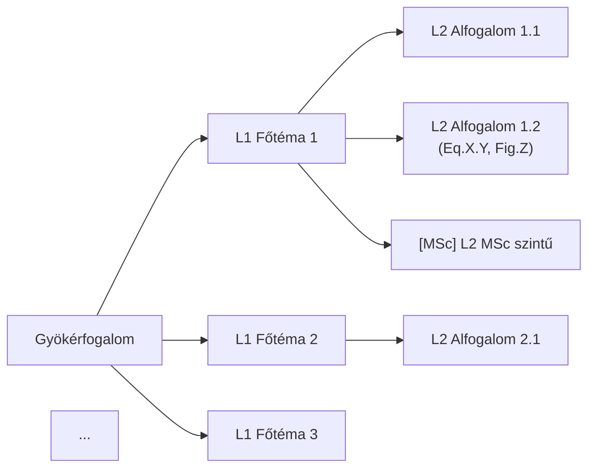

---
name: 03_mindmap_builder
title: 03_MINDMAP_BUILDER — Hierarchikus elmetérkép generálása
type: skill
tags: [meta, skill]
role: ??
status: active
version: 1.3
updated: 2026-06-05
description: Claude elolvassa az összes forrást és fogalmi összefüggések alapján hierarchikus mindmapet generál. Ha 02_mineru_to_catalog futott, a strukturált MinerU markdown az elsődleges szövegforrás (raw PDF fallback). A felhasználó revideálja, MSc-ágakat jelöl. Ez a pipeline sarokköve.
---

# 03_MINDMAP_BUILDER

## 1. Cél

Claude az összes `1_raw_inputs/` forrást teljes egészében elolvassa, és fogalmi összefüggések
alapján — nem merev fejezet-hierarchia szerint — hierarchikus mindmapet generál.
A mindmap az összes downstream output (04–10) vezérfonala.

**Input:** `1_raw_inputs/*.pdf, *.pptx` (eredeti forrásanyagok)
**Output:** `3_mindmap/mindmap.md` (Mermaid `flowchart LR`, ?? jóváhagyás után végleges)
**WIP Output:** `test_outputs/{tárgy}/{N}_het/4_wip_outputs/{N}_Mindmap_horz.md` (LR) és `{N}_Mindmap_vert.md` (TD) — draft

## 2. Bemenetek

| Fájl | Honnan | Tartalom | Prioritás |
|:-----|:-------|:---------|:----------|
| `2_clean_inputs/<stem>/mineru/<stem>.md` | 02_mineru_to_catalog | **Elsődleges szövegforrás** — heading-strukturált MD, LaTeX formulák, tábla-MD, helyes olvasási sorrend (kéthasábos PDF-ek is) | **L1** |
| `1_raw_inputs/*.pdf`, `*.pptx` | 01_source_collector | Fallback — ha MinerU markdown nem elérhető, Claude közvetlenül olvassa | L2 |
| `2_clean_inputs/figure_catalog.json` | 02_mineru_to_catalog | Kinyert ábrák + caption + text_context + keywords (L3 hivatkozásokhoz és Fig.X.Y-hoz) | L1 |
| `1_raw_inputs/citations.json` | 01_source_collector | Forrás-metaadatok (szerző, év, citációs kulcsok) | L1 |

**Előfeltétel:** `02_mineru_to_catalog` sikeresen lefutott (`figure_catalog.json` + `mineru/` mappák elérhetők); `1_raw_inputs/` nem üres.

**Miért MinerU markdown > raw PDF:**
- Heading-szintek (`#`, `##`) megmaradnak → az L1/L2 ágak természetes struktúrát kapnak
- LaTeX formulák (`$...$`, `$$...$$`) már kinyerve → `Eq.X.Y` referenciák pontosan beilleszthetők
- Táblák Markdown-ban → összehasonlítás-csomópontok azonnal létrehozhatók
- Kéthasábos PDFs olvasási sorrendben → nem kevertek az ágak

## 3. Eljárás

### 3.1. Forrásbeolvasás

**Ha `02_mineru_to_catalog` lefutott (standard pipeline):**
```
Elsődleges olvasás: 2_clean_inputs/<stem>/mineru/<stem>.md — minden forrásra
Egyúttal:           2_clean_inputs/figure_catalog.json (ábrák + caption + text_context)
                    1_raw_inputs/citations.json (citációs kulcsok)
```
A MinerU markdown heading-struktúrája (`#`, `##`) közvetlen forrás az L1/L2 ágakhoz. A `figure_catalog.json` `text_context` mezői az ábra-környezet megértéséhez használhatók.

**Ha MinerU markdown nem elérhető (fallback):**
```
Olvasd be: 1_raw_inputs/*.pdf, *.pptx (raw, Claude közvetlenül)
```
Ha weblap-PDF, a URL-t jegyezd fel. Cél: **teljes megértés**, nem szemelvényezés.

### 3.2. Fogalmi szintézis

A beolvasás után azonosítsd:
- **Gyökérfogalom:** mi a fő téma?
- **L1 ágak (3–6 db):** a gyökér fő altémái — fogalmi logika alapján (nem forrás-sorrendben)
- **L2 csomópontok (3–5/ág):** az L1 ágak alfogalmai
- **L3 részletek (opcionális):** képletek, ábrahivatkozások, kulcsdefiníciók

**Alapelv: a megértés diktálja a struktúrát.** Ha az egyik forrás fejezet-beosztása és
a fogalmi logika eltér — a fogalmi logika győz.

### 3.3. Mindmap megírása

Formátum: **Mermaid `flowchart LR`**, 3 szint mélyen.



**Szabályok:**
- `[MSc]` prefix: Claude javasolja az MSc-szintű csomópontokat (felhasználó véglegesíti)
- Ábrahivatkozás L3-ban: `Fig.X.Y` formátumban, ha figure_catalog tartalmazza
- Egyenlet-hivatkozás L3-ban: `Eq.X.Y` ha a forrásban számozott
- Hosszú szöveg: `\n`-nel tördelj a csomóponton belül
- Kerüld: `"`, `'`, `(`, `)` speciális karakterek — cseréld szóra

### 3.4. Mentés

**Fő output:**
```
3_mindmap/mindmap.md
```

**WIP másolatok (draft munkafolyamati verziók):**
```
test_outputs/{tárgy}/{N}_het/4_wip_outputs/{N}_Mindmap_horz.md    ‹ flowchart LR
test_outputs/{tárgy}/{N}_het/4_wip_outputs/{N}_Mindmap_vert.md    ‹ flowchart TD
```

A wip_outputs verziókban:
- Csak cím és mindmap Mermaid blokk marad (YAML frontmatter + referencia-tábla törlve)
- lowchart LR › horz (horizontal/baloldali-jobboldali)
- lowchart TD › ert (vertical/topdown)
- Mindkét verzió ugyanazt az elemetérképet tartalmazza, csak más irányultságban

YAML frontmatter kötelező a fő fájlban:

```yaml
---
title: Mindmap — {tantárgy} {N}. hét
type: mindmap
tags: [prod/test, mindmap]
subject: {tantárgy neve}
week: N
sources: [fájlnév1, fájlnév2, ...]
msc_nodes: [csomópont1, csomópont2, ...]  ‹ Claude javaslata
created: YYYY-MM-DD
status: draft  ‹ ?? jóváhagyás után: approved
---
```

### 3.5. Checkpoint — ?? felhasználói revízió

A draft mindmap elkészítése után:

1. **Struktúra ellenőrzés:** az L1 ágak fedik a témát? Hiányzik valami? Felesleges valami?
2. **MSc jelölés véglegesítése:** Claude javaslatai (`[MSc]`) elfogadva vagy módosítva?
3. **Forrás-lefedettség:** minden fontos forrásból bekerült a lényeg?
4. **Vizuális egyensúly:** egy ág sem terhelt le 8+ csomóponttal?

A felhasználó módosítja a fájlt közvetlenül, majd: `status: approved`.

**?? A 04_content_synthesizer csak `status: approved` mindmap alapján indul!**

## 4. Kimenetek

| Fájl | Tartalom |
|:-----|:---------|
| `3_mindmap/mindmap.md` | Mermaid flowchart LR, [MSc] jelölések, status: approved |
| `test_outputs/{tárgy}/{N}_het/4_wip_outputs/{N}_Mindmap_horz.md` | Draft LR verzió — cím + flowchart LR, metaadat nélkül |
| `test_outputs/{tárgy}/{N}_het/4_wip_outputs/{N}_Mindmap_vert.md` | Draft TD verzió — cím + flowchart TD, metaadat nélkül |

## 5. Ellenőrzés

- [ ] Minden L1 ág azonosítható az `1_raw_inputs/` forrásokban?
- [ ] `[MSc]` jelölések konzisztensek (szülő [MSc] › gyerek is [MSc])?
- [ ] Mermaid szintaxis hibamentes (idézőjelek, zárójelek kerülve)?
- [ ] `status: approved` a YAML-ban?
- [ ] Ábrahivatkozások (`Fig.X.Y`) egyeznek a `figure_catalog.json`-nel?

## 6. Hibakezelés

| Tünet | Ok | Megoldás |
|:------|:---|:---------|
| Mermaid `Parse error` | Speciális karakter a csomópontban | `"`, `'`, `(`, `)` cseréje szóra |
| Mindmap túl lapos (csak L1) | Forrás feldolgozás hiányos | Forrásokat fejezet-szinten is olvasd végig |
| Mindmap túl mély (L4+) | Túlrészletezés | L3 szintet max. kulcsképletekre korlátozd |
| L1 ágak forrás-sorrendben | Nem fogalmi szintézis | Reorganizálás fogalmi logika szerint |
| Figure_catalog üres | MinerU nem futott / nincs PDF | `<!-- FIGURE: -->` placeholder — folytatható |
| MinerU markdown hiányzik (`<stem>/mineru/`) | `02_mineru_to_catalog` nem futott | Fallback: raw PDF olvasás; figyelj a heading-struktúra elvesztésére |

## 7. Hivatkozások

- [pipeline.md](../pipeline.md) — §3 Checkpoint táblázat
- [04_content_synthesizer.md](04_content_synthesizer.md) — downstream skill
- [Instructions.md](../../Instructions.md) — §7 Vizuális gazdagítás szabályok

## 8. Visszajelzések

## 9. Változásjegyzék

| Dátum | Verzió | Leírás |
|-------|--------|--------|
| 2026-06-01 | 1.0 | Létrehozva (claude_play 08_mindmap_manager alapján, Claude-natív) |
| 2026-06-03 | 1.1 | §2 input javítva: `2_clean_inputs/**/*.md` › `1_raw_inputs/` (02 skill csak képet termel, szöveg-szintézis Claude direkt PDF-olvasással); §3.1 + §5 igazítva |
| 2026-06-05 | 1.3 | MinerU-first pipeline: §2 MinerU `.md` elsődleges szövegforrás (raw PDF fallback); §3.1 kettéválasztva standard/fallback; §6 új hibasor. Gain: heading-struktúra, LaTeX formulák, tábla-MD, kéthasábos olvasási sorrend. |
| 2026-06-03 | 1.2 | §3.4, §4 bővítve: WIP draft verziók (1_Mindmap_horz.md LR + 1_Mindmap_vert.md TD) wip_outputs/atg/ alatt


