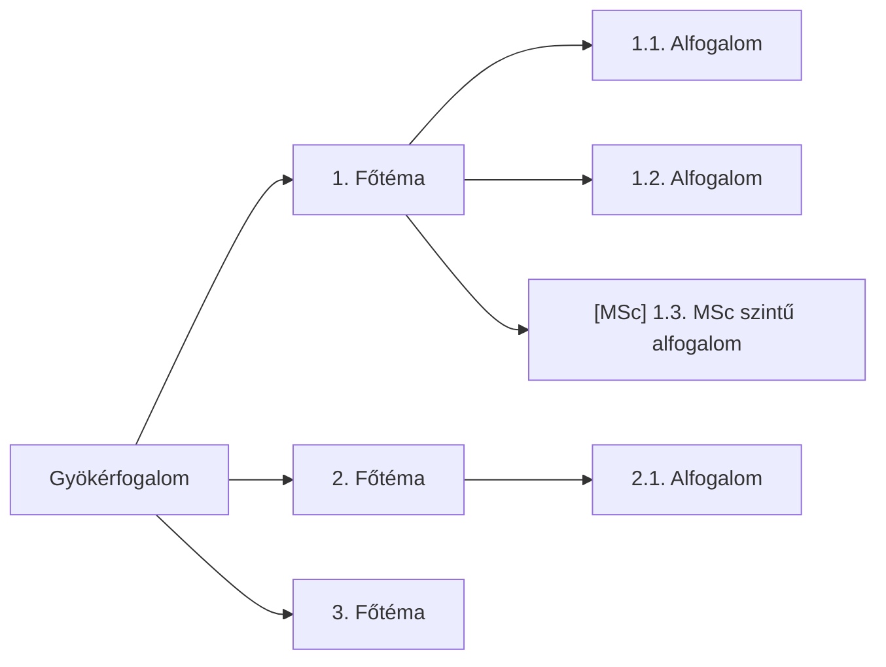

---
name: 03_mindmap_builder
title: 03_MINDMAP_BUILDER — Hierarchikus elmetérkép generálása
type: skill
tags: [meta, skill]
role: 🤖
status: active
version: 1.6
updated: 2026-06-11
description: Claude elolvassa az összes forrást és fogalmi összefüggések alapján hierarchikus mindmapet generál. Ha 02_mineru_to_catalog futott, a strukturált MinerU markdown az elsődleges szövegforrás (raw PDF fallback). A felhasználó revideálja, MSc-ágakat jelöl. Ez a pipeline sarokköve.
---

# 03_MINDMAP_BUILDER

## 1. Cél

Claude az összes `1_raw_inputs/` forrást teljes egészében elolvassa, és fogalmi összefüggések
alapján — nem merev fejezet-hierarchia szerint — hierarchikus mindmapet generál.
A mindmap az összes downstream output (04–10) vezérfonala.

**Input:** `1_raw_inputs/*.pdf, *.pptx` (eredeti forrásanyagok)
**Output:** `3_mindmap/mindmap.md` (Mermaid `flowchart LR`, 😎 jóváhagyás után végleges)
**WIP Output:** `test_outputs/{tárgy}/{N}_het/4_wip_outputs/{N}_Mindmap_horz.md` (LR) és `{N}_Mindmap_vert.md` (TD) — draft

## 2. Bemenetek

| Fájl | Honnan | Tartalom | Prioritás |
|:-----|:-------|:---------|:----------|
| `2_clean_inputs/<stem>/mineru/<stem>.md` | 02_mineru_to_catalog | **Elsődleges szövegforrás** — heading-strukturált MD, LaTeX formulák, tábla-MD, helyes olvasási sorrend (kéthasábos PDF-ek is) | **L1** |
| `1_raw_inputs/*.pdf`, `*.pptx` | 01_source_collector | Fallback — ha MinerU markdown nem elérhető, Claude közvetlenül olvassa | L2 |
| `2_clean_inputs/figure_catalog.json` | 02_mineru_to_catalog | Kinyert ábrák + caption + text_context + keywords (L3 hivatkozásokhoz és Fig.X.Y-hoz) | L1 |
| `1_raw_inputs/citations.json` | 01_source_collector | Forrás-metaadatok (szerző, év, citációs kulcsok) | L1 |

**Előfeltétel:** `02_mineru_to_catalog` sikeresen lefutott (`figure_catalog.json` + `mineru/` mappák elérhetők); `1_raw_inputs/` nem üres.

**Miért MinerU markdown > raw PDF:**
- Heading-szintek (`#`, `##`) megmaradnak → az L1/L2 ágak természetes struktúrát kapnak
- LaTeX formulák (`$...$`, `$$...$$`) már kinyerve → `Eq.X.Y` referenciák pontosan beilleszthetők
- Táblák Markdown-ban → összehasonlítás-csomópontok azonnal létrehozhatók
- Kéthasábos PDFs olvasási sorrendben → nem kevertek az ágak

## 3. Eljárás

### 3.1. Forrásbeolvasás

**Ha `02_mineru_to_catalog` lefutott (standard pipeline):**
```
Elsődleges olvasás: 2_clean_inputs/<stem>/mineru/<stem>.md — minden forrásra
Egyúttal:           2_clean_inputs/figure_catalog.json (ábrák + caption + text_context)
                    1_raw_inputs/citations.json (citációs kulcsok)
```
A MinerU markdown heading-struktúrája (`#`, `##`) közvetlen forrás az L1/L2 ágakhoz. A `figure_catalog.json` `text_context` mezői az ábra-környezet megértéséhez használhatók.

**Ha MinerU markdown nem elérhető (fallback):**
```
Olvasd be: 1_raw_inputs/*.pdf, *.pptx (raw, Claude közvetlenül)
```
Ha weblap-PDF, a URL-t jegyezd fel. Cél: **teljes megértés**, nem szemelvényezés.

### 3.2. Fogalmi szintézis

A beolvasás után azonosítsd:
- **Gyökérfogalom:** mi a fő téma?
- **L1 ágak (3–6 db):** a gyökér fő altémái — fogalmi logika alapján (nem forrás-sorrendben)
- **L2 csomópontok (3–5/ág):** az L1 ágak alfogalmai
- **L3 részletek (opcionális):** képletek, ábrahivatkozások, kulcsdefiníciók

**Alapelv: a megértés diktálja a struktúrát.** Ha az egyik forrás fejezet-beosztása és
a fogalmi logika eltér — a fogalmi logika győz.

### 3.3. Mindmap megírása

Formátum: **Mermaid `flowchart LR`**, 3 szint mélyen.



### 3.3.1. Nem renderelt réteg — ábra/képlet/forrás-leképezés

A node-okból kihagyott ábra-, képlet- és forrás-hivatkozások egy **nem renderelt**
HTML-kommentbe kerülnek a Mermaid-blokk után. Ez a réteg köti össze a node-okat a
forrásrészletekkel (downstream 04/05/09 használhatja), és a renderelt mindmapet tisztán tartja.

```text
<!-- ÁBRAHIVATKOZÁSOK (nem renderelt metaadat)
A1 (1.1): <forrás> Fig.X.Y — rövid leírás
A3 (1.3): <forrás> Eq.X.Y — rövid leírás
-->
```

> 💡 A strukturált, gépileg lekérdezhető változata (node → forrás-chunk index, háttér-RAG) a
> jövőbeni megfontolások közt: [project_status.md](../project_status.md) „Ötletek".

**Szabályok:**

1. **Számozás — minden szám után pont.** L1: `N.` (pl. `1. Főtéma`), L2: `N.M.` (pl. `1.1. Alfogalom`).
   Konzisztens a downstream 04 `## N.` / `### N.M` fejléc-sémával.
2. **Ábra és képlet TILOS a renderelt node-ban.** Nincs ábrahivatkozás (`Fig.X.Y`), egyenlet-hivatkozás
   (`Eq.X.Y`), sem inline képlet-töredék. Ezek a **nem renderelt** kommentblokkba kerülnek (lásd §3.3.1).
   Indok: a 04_content_synthesizer az ábrát a `figure_catalog.json`-ból, a képletet a MinerU markdownból
   veszi — a node-ban csak zaj.
3. **`[MSc]` jelölés egységes.** Pontosan `[MSc]` — szögletes zárójel, pont ezzel a kis-/nagybetűzéssel.
   Tilos a `MSc`/`MsC`/`Msc` zárójel nélkül és a `(MSc)` kerek zárójel. (A 04 §3.8 szó szerint erre illeszt.)
4. **Megnevezés igen, citáció nem.** Egy fogalomra/modellre a **nevével** hivatkozz; a hozzá tartozó
   évszám és szerző-citáció a node-ból elhagyandó — a citáció a Jegyzetben, IEEE-vel jön (08 §8).
5. **`<br>` csak indokolt esetben.** A renderer többnyire automatikusan tördel; `<br>`-t csak akkor
   használj, ha valódi logikai tagolást jelöl (fő fogalom + rövid pontosítás). Alapértelmezés: rövid,
   egysoros címke.
6. **Idegen szavak óvatosan.** Ahol van bevett magyar megfelelő, azt használd; a meghonosodott vagy
   lefordíthatatlan szakszavakat tartsd meg eredetiben. Ügyelj a nyíl→szó szivárgásra: a `→`/`->`-ból
   ne legyen `to`/`hoz` szó a címkében — a kapcsolatot **él** fejezi ki, nem szöveg.
7. **Egyszerű node-cím.** Egy node = egy fogalom; ne pakold tele jelzővel/képlettel.
8. **Egygyerekes node megengedett**, ha köztes fogalmi lépcsőként segíti a megértést.
9. **Szigorú fa — csak szülő→gyermek él.** A mindmap `flowchart LR` **fa**: minden node-nak pontosan
   egy bejövő éle van (a szülőtől). **Tilos** minden egyéb él: kereszt-él (ágak közti), testvér-él,
   és bármely él, amely távoli node-okat köt össze vagy egy közös node-ba futtat — ezek átlósan
   átszelik a diagramot és törik az LR-elrendezést. A nem hierarchikus (ág-ág, fogalmi) kapcsolatokat
   a nem renderelt kísérőszövegben (§3.3.1) magyarázd, **ne éllel**.
10. **Speciális karakterek:** kerüld a `"`, `'`, `(`, `)` jeleket a node-ban — cseréld szóra.

### 3.4. Mentés

**Fő output:**
```
3_mindmap/mindmap.md
```

**WIP másolatok (draft munkafolyamati verziók):**
```
test_outputs/{tárgy}/{N}_het/4_wip_outputs/{N}_Mindmap_horz.md    ‹ flowchart LR
test_outputs/{tárgy}/{N}_het/4_wip_outputs/{N}_Mindmap_vert.md    ‹ flowchart TD
```

A wip_outputs verziókban:
- Csak cím és mindmap Mermaid blokk marad (YAML frontmatter + referencia-tábla törölve)
- flowchart LR › horz (horizontal/baloldali-jobboldali)
- flowchart TD › vert (vertical/topdown)
- Mindkét verzió ugyanazt az elmetérképet tartalmazza, csak más irányultságban

YAML frontmatter kötelező a fő fájlban:

```yaml
---
title: Mindmap — {tantárgy} {N}. hét
type: mindmap
tags: [prod/test, mindmap]
subject: {tantárgy neve}
week: N
sources: [fájlnév1, fájlnév2, ...]
msc_nodes: [csomópont1, csomópont2, ...]  ‹ Claude javaslata
created: YYYY-MM-DD
status: draft  ‹ 😎 jóváhagyás után: approved
---
```

### 3.5. Checkpoint — 😎 felhasználói revízió

A draft mindmap elkészítése után:

1. **Struktúra ellenőrzés:** az L1 ágak fedik a témát? Hiányzik valami? Felesleges valami?
2. **MSc jelölés véglegesítése:** Claude javaslatai (`[MSc]`) elfogadva vagy módosítva?
3. **Forrás-lefedettség:** minden fontos forrásból bekerült a lényeg?
4. **Vizuális egyensúly:** egy ág sem terhelt le 8+ csomóponttal?

A felhasználó módosítja a fájlt közvetlenül, majd: `status: approved`.

**🚦 A 04_content_synthesizer csak `status: approved` mindmap alapján indul!**

## 4. Kimenetek

| Fájl | Tartalom |
|:-----|:---------|
| `3_mindmap/mindmap.md` | Mermaid flowchart LR, [MSc] jelölések, status: approved |
| `test_outputs/{tárgy}/{N}_het/4_wip_outputs/{N}_Mindmap_horz.md` | Draft LR verzió — cím + flowchart LR, metaadat nélkül |
| `test_outputs/{tárgy}/{N}_het/4_wip_outputs/{N}_Mindmap_vert.md` | Draft TD verzió — cím + flowchart TD, metaadat nélkül |

## 5. Teszt

- **Fixture:** `test_outputs/atg/1_het` — MinerU markdown + `figure_catalog.json` (v4) + `citations.json`.
- **Akció:** §3 — Claude beolvassa a forrásokat és fogalmi hierarchiát épít.
- **Várt kimenet:** `3_mindmap/mindmap.md` (Mermaid `flowchart LR`, 3–6 L1 ág, `status: draft`) + WIP horz/vert másolatok.
- **Eval:** §6 ellenőrzőlista + 🚦 😎 checkpoint (struktúra/lefedettség).

## 6. Ellenőrzés

- [ ] Minden L1 ág azonosítható az `1_raw_inputs/` forrásokban?
- [ ] Minden L1/L2 szám után pont (`5.`, `1.1.`)?
- [ ] Nincs `Fig.X.Y`, `Eq.X.Y` vagy inline matek a renderelt node-ban (csak a nem renderelt blokkban)?
- [ ] `[MSc]` egységes (szögletes zárójel, nincs `MsC`/`(MSc)` variáns)? Szülő [MSc] › gyerek is [MSc]?
- [ ] Indokolatlan idegen szó (van magyar megfelelője) vagy nyíl→szó (`to`/`hoz`) szivárgás a címkékben?
- [ ] `<br>` csak indokolt logikai tagolásnál?
- [ ] Szigorú fa: csak szülő→gyermek él (nincs kereszt-/testvér-él, nincs közös node-ba futtatás)?
- [ ] Mermaid szintaxis hibamentes (idézőjelek, zárójelek kerülve)?
- [ ] `status: approved` a YAML-ban?
- [ ] A nem renderelt ábra/képlet-hivatkozások egyeznek a `figure_catalog.json`-nel?

## 7. Hibakezelés

| Tünet | Ok | Megoldás |
|:------|:---|:---------|
| Mermaid `Parse error` | Speciális karakter a csomópontban | `"`, `'`, `(`, `)` cseréje szóra |
| Mindmap túl lapos (csak L1) | Forrás feldolgozás hiányos | Forrásokat fejezet-szinten is olvasd végig |
| Mindmap túl mély (L4+) | Túlrészletezés | L3 szintet max. kulcsképletekre korlátozd |
| L1 ágak forrás-sorrendben | Nem fogalmi szintézis | Reorganizálás fogalmi logika szerint |
| Figure_catalog üres | MinerU nem futott / nincs PDF | `<!-- FIGURE: -->` placeholder — folytatható |
| MinerU markdown hiányzik (`<stem>/mineru/`) | `02_mineru_to_catalog` nem futott | Fallback: raw PDF olvasás; figyelj a heading-struktúra elvesztésére |
| Fig/Eq vagy inline matek a renderelt node-ban | Forrás-zaj a vázlatban | Áthelyezés a nem renderelt blokkba (§3.3.1); a node csak fogalmat tartalmaz |
| `to`/`hoz` szó a node-címben | `→` nyíl szövegként szivárgott be | A kapcsolatot éllel fejezd ki; a címkéből töröld |

## 8. Hivatkozások

- [pipeline.md](../pipeline.md) — §3 Checkpoint táblázat
- [04_content_synthesizer.md](04_content_synthesizer.md) — downstream skill
- [Instructions.md](../../Instructions.md) — §7 Vizuális gazdagítás szabályok

## 9. Visszajelzések

- 💡 **2. sprint — háttér-RAG / láthatatlan metaadat:** a MinerU-ból nyert többletinformáció
  (`text_context`, `caption`, `keywords`, oldal- és Fig/Eq-azonosítók) node-onként strukturált,
  nem renderelt blokkban → node→forrás-chunk leképezés, ami egy lekérdezhető retrieval-index
  alapja lehet (04 szintézis és 09 kérdésbank célzottan a releváns forrásrészre hivatkozhat a
  teljes PDF újraolvasása helyett). Részletek: [project_status.md](../project_status.md) „Ötletek".

## 10. Változásjegyzék

| Dátum | Verzió | Leírás |
|-------|--------|--------|
| 2026-06-01 | 1.0 | Létrehozva (claude_play 08_mindmap_manager alapján, Claude-natív) |
| 2026-06-03 | 1.1 | §2 input javítva: `2_clean_inputs/**/*.md` › `1_raw_inputs/` (02 skill csak képet termel, szöveg-szintézis Claude direkt PDF-olvasással); §3.1 + §5 igazítva |
| 2026-06-03 | 1.2 | §3.4, §4 bővítve: WIP draft verziók (`1_Mindmap_horz.md` LR + `1_Mindmap_vert.md` TD) a `4_wip_outputs/` alatt |
| 2026-06-05 | 1.3 | MinerU-first pipeline: §2 MinerU `.md` elsődleges szövegforrás (raw PDF fallback); §3.1 kettéválasztva standard/fallback; §6 új hibasor. Gain: heading-struktúra, LaTeX formulák, tábla-MD, kéthasábos olvasási sorrend. |
| 2026-06-05 | 1.4 | §3.3 Szabályok újraírva 😎 visszajelzés alapján: minden szám után pont; Fig/Eq/inline matek tilos a renderelt node-ban (→ új §3.3.1 nem renderelt réteg); `[MSc]` egységes forma; modellnév évszám nélkül; `<br>` csak indokolt; idegen szavak óvatosan + nyíl→szó szivárgás tiltva; egyszerű/egygyerekes node OK; szigorú fa — csak szülő→gyermek él (kereszt-/testvér-él, közös node-ba futtatás tiltva). §5 checklist + §6 két hibasor + §8 RAG-ötlet. |
| 2026-06-11 | 1.5 | Higiénia: 😎-emoji helyreállítva (mojibake `??`→😎); typók javítva (`flowchart`/`vert`/`elmetérkép`/`törölve`); changelog kronológiai sorrendbe (legfrissebb alul) + lezáratlan 1.2 sor zárva. |
| 2026-06-11 | 1.6 | §Teszt pótolva (atg/1_het); §5→§10 átszámozva (sablon-konform). |
