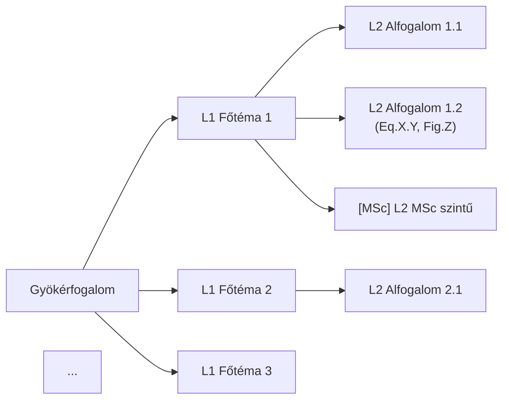

---
name: 03_mindmap_builder
title: 03_MINDMAP_BUILDER — Hierarchikus elmetérkép generálása
type: skill
tags: [meta, skill]
status: active
version: 1.0
updated: 2026-06-01
description: Claude elolvassa az összes forrást és fogalmi összefüggések alapján hierarchikus mindmapet generál. A felhasználó revideálja, MSc-ágakat jelöl. Ez a pipeline sarokköve.
---

# 03_MINDMAP_BUILDER

## 1. Cél

Claude az összes `2_clean_inputs/` forrást teljes egészében elolvassa, és fogalmi összefüggések
alapján — nem merev fejezet-hierarchia szerint — hierarchikus mindmapet generál.
A mindmap az összes downstream output (04–10) vezérfonala.

**Input:** `2_clean_inputs/**/*.md` (MinerU/extraktor kimenetek)
**Output:** `3_mindmap/mindmap.md` (Mermaid `flowchart LR`, 😎 jóváhagyás után végleges)

## 2. Bemenetek

| Fájl | Honnan | Tartalom |
|:-----|:-------|:---------|
| `2_clean_inputs/{forrás}/{forrás}.md` | 02_image_extraction | Tisztított szöveg, képhivatkozásokkal |
| `2_clean_inputs/figure_catalog.json` | 02_image_extraction | Kinyert ábrák metaadatai |
| `1_raw_inputs/citations.json` | 01_source_collector | Forrás-metaadatok (szerző, év, oldalak) |

**Előfeltétel:** `02_image_extraction` sikeresen lefutott; `2_clean_inputs/` nem üres.

## 3. Eljárás

### 3.1. Forrásbeolvasás

Olvasd be az összes `2_clean_inputs/` fájlt. Ha PDF-forrás, az oldalszámokat jegyezd fel.
Ha weblap, a URL-t jegyezd fel. Cél: **teljes megértés**, nem szemelvényezés.

```
Elolvasandó fájlok: 2_clean_inputs/**/*.md
Egyúttal: figure_catalog.json (elérhető ábrák listája)
```

### 3.2. Fogalmi szintézis

A beolvasás után azonosítsd:
- **Gyökérfogalom:** mi a fő téma?
- **L1 ágak (3–6 db):** a gyökér fő altémái — fogalmi logika alapján (nem forrás-sorrendben)
- **L2 csomópontok (3–5/ág):** az L1 ágak alfogalmai
- **L3 részletek (opcionális):** képletek, ábrahivatkozások, kulcsdefiníciók

**Alapelv: a megértés diktálja a struktúrát.** Ha az egyik forrás fejezet-beosztása és
a fogalmi logika eltér — a fogalmi logika győz.

### 3.3. Mindmap megírása

Formátum: **Mermaid `flowchart LR`**, 3 szint mélyen.



**Szabályok:**
- `[MSc]` prefix: Claude javasolja az MSc-szintű csomópontokat (felhasználó véglegesíti)
- Ábrahivatkozás L3-ban: `Fig.X.Y` formátumban, ha figure_catalog tartalmazza
- Egyenlet-hivatkozás L3-ban: `Eq.X.Y` ha a forrásban számozott
- Hosszú szöveg: `\n`-nel tördelj a csomóponton belül
- Kerüld: `"`, `'`, `(`, `)` speciális karakterek — cseréld szóra

### 3.4. Mentés

```
3_mindmap/mindmap.md
```

YAML frontmatter kötelező:

```yaml
---
title: Mindmap — {tantárgy} {N}. hét
type: mindmap
tags: [prod/test, mindmap]
subject: {tantárgy neve}
week: N
sources: [fájlnév1, fájlnév2, ...]
msc_nodes: [csomópont1, csomópont2, ...]  ← Claude javaslata
created: YYYY-MM-DD
status: draft  ← 😎 jóváhagyás után: approved
---
```

### 3.5. Checkpoint — 😎 felhasználói revízió

A draft mindmap elkészítése után:

1. **Struktúra ellenőrzés:** az L1 ágak fedik a témát? Hiányzik valami? Felesleges valami?
2. **MSc jelölés véglegesítése:** Claude javaslatai (`[MSc]`) elfogadva vagy módosítva?
3. **Forrás-lefedettség:** minden fontos forrásból bekerült a lényeg?
4. **Vizuális egyensúly:** egy ág sem terhelt le 8+ csomóponttal?

A felhasználó módosítja a fájlt közvetlenül, majd: `status: approved`.

**⚠️ A 04_content_synthesizer csak `status: approved` mindmap alapján indul!**

## 4. Kimenetek

| Fájl | Tartalom |
|:-----|:---------|
| `3_mindmap/mindmap.md` | Mermaid flowchart LR, [MSc] jelölések, status: approved |

## 5. Ellenőrzés

- [ ] Minden L1 ág azonosítható a forrásokban?
- [ ] `[MSc]` jelölések konzisztensek (szülő [MSc] → gyerek is [MSc])?
- [ ] Mermaid szintaxis hibamentes (idézőjelek, zárójelek kerülve)?
- [ ] `status: approved` a YAML-ban?
- [ ] Ábrahivatkozások (`Fig.X.Y`) egyeznek a `figure_catalog.json`-nel?

## 6. Hibakezelés

| Tünet | Ok | Megoldás |
|:------|:---|:---------|
| Mermaid `Parse error` | Speciális karakter a csomópontban | `"`, `'`, `(`, `)` cseréje szóra |
| Mindmap túl lapos (csak L1) | Forrás feldolgozás hiányos | Forrásokat fejezet-szinten is olvasd végig |
| Mindmap túl mély (L4+) | Túlrészletezés | L3 szintet max. kulcsképletekre korlátozd |
| L1 ágak forrás-sorrendben | Nem fogalmi szintézis | Reorganizálás fogalmi logika szerint |
| Figure_catalog üres | MinerU nem futott / nincs PDF | `<!-- FIGURE: -->` placeholder — folytatható |

## 7. Hivatkozások

- [pipeline.md](../pipeline.md) — §3 Checkpoint táblázat
- [04_content_synthesizer.md](04_content_synthesizer.md) — downstream skill
- [Instructions.md](../../Instructions.md) — §7 Vizuális gazdagítás szabályok

## 8. Visszajelzések

## 9. Változásjegyzék

| Dátum | Verzió | Leírás |
|-------|--------|--------|
| 2026-06-01 | 1.0 | Létrehozva (claude_play 08_mindmap_manager alapján, Claude-natív) |
