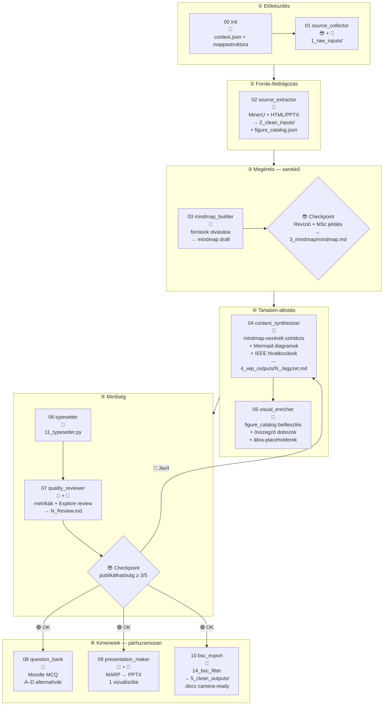

# `claude_course` — új repo tervvázlat

## Kontextus

A `claude_play` (NLM-alapú) megmutatta: az IO-kontrakt hiánya és a fragmentált DFS-megközelítés
alapvető problémák. Az új `claude_course` repo nulláról épül, organikusan, a tananyagfejlesztés
tradicionális menetéhez igazodva — ahol Claude az oktató „elmetérképét" helyettesíti.

`claude_play` → archív, referencia. Nem módosítjuk.

---

## 1. A tradicionális tananyagfejlesztés → Claude-leképezés

Az oktató valódi munkafolyamata, ahogy te leírtad:

| # | Oktató csinálja | Claude-pipeline megfelelője |
|---|-----------------|------------------------------|
| 1 | Célcsoport, tanterv meghatározás | `00_init` — `context.json` (szint, hetek, tantárgy) |
| 2 | Anyaggyűjtés, válogatás | `01_source_collector` 😎 + 🤖 |
| 3 | Olvas → megért → szűr → szintetizál | `02_source_extractor` 🐍 + **`03_mindmap_builder` 🤖** |
| 4 | **Elmetérkép a fejében** | **03 kimenet: mindmap** — Claude szintetizálja, te revideálod ✅ |
| 5 | Word: ír, hivatkozik, képeket illeszt, egyenleteket magyaráz | `04_content_synthesizer` 🤖 |
| 6 | Szintetizál — de **nem fejezet, hanem megértés szerint** | 04: mindmap-csomópont → szekció (nem lineáris) |
| 7 | Word → PowerPoint | `09_presentation_maker` 🤖+🐍 |
| 8 | Vizsgakérdések (Moodle MCQ) | `08_question_bank` 🤖 |
| 9 | YouTube videó-referenciák | `08` kiegészítése — opcionális médialink szekció |
| 10 | Jupyter notebook — szemléltetés | 🔲 Jövőbeni lépés: `11_notebook_maker` |

### Kulcselv: A megértés diktálja a struktúrát

A mindmap nem egy előre adott fejezethierarchia-sablon. A mindmap **az olvasásból emergál** —
Claude az összes forrást elolvassa és a fogalmi összefüggések alapján szervezi a csomópontokat.
A felhasználó revíziója a checkpoint. Csak utána indul a tartalom-szintézis.

---

## 2. Pipeline-gráf — Mermaid skeleton



**Megjegyzések:**
- `03 → 😎` az egyetlen kötelező emberi beavatkozás a tartalomban (a többi opcionális checkpoint)
- `08`, `09`, `10` egymástól független → párhuzamos futás
- Jupyter notebook (`11`) a jövőben csatolható be a `CREATE` blok után

---

## 3. Vizuális gazdagítás stratégia ("képnehéz")

### 3.1 Négy réteg, kötelező/opcionális

| Réteg | Szabály | Generálás |
|-------|---------|-----------|
| **Navigátor mindmap** | Minden output tetején link; MARP 2. diája | 🤖 03 kimenet |
| **Szekciós diagram** | Minden mindmap-csomóponthoz (ha ≥3 fogalom összefügg) | 🤖 04 inline |
| **Valódi ábra** | MinerU-kinyert PNG, ha elérhető; különben `<!-- FIGURE: ... -->` placeholder | 🐍+🤖 05 |
| **MARP vizuális** | Minden dián 1 Mermaid VAGY ábra kötelező | 🤖 09 |

### 3.2 Diagram-típus döntési fa

```
Van folyamat/szekvencia? → flowchart TD
Van hierarchia/fa?       → flowchart LR
Van időbeli lefolyás?    → sequence diagram
Van összehasonlítás?     → Markdown table (nem Mermaid)
Van összefoglaló blokk?  → 📦 doboz (blockquote + bullets)
```

---

## 4. Citáció-rendszer (UUID-mentes)

```json
// citations.json — fájlnév-alapú, IEEE-kompatibilis
{
  "_meta": {"subject": "...", "week": 1},
  "1": {"author": "Randall, R.B.", "title": "Frequency Analysis", "year": "1987",
        "publisher": "Brüel & Kjær", "filename": "randall1987.pdf", "pages": "11-77"},
  "2": {"author": "Wikipedia", "title": "Compressor map", "url": "https://...", "accessed": "2026-06-01"}
}
```

- Minden wip és clean output tartalmaz `## Hivatkozásjegyzék` szekciót
- Formátum: IEEE (`[1] Szerző. *Cím.* Kiadó, év.`)
- A `08_ieee_renderer.py` (meglévő `07-2` script kisebb patchcsel) generálja

---

## 5. Repo-struktúra

```
claude_course/
├── CLAUDE.md
├── Instructions.md               ← claude_play-ből portolva (hard-cap megtartva)
├── .claude/
│   ├── pipeline.md               ← ÚJ (§2 gráf alapján)
│   ├── project_status.md
│   ├── skill_template.md         ← változatlan
│   ├── nlm_prompts.md            ← TÖRÖLVE (NLM nem releváns)
│   └── skills/
│       ├── 00_init.md
│       ├── 01_source_collector.md
│       ├── 02_source_extractor.md
│       ├── 03_mindmap_builder.md        ← ÚJ, sarokkő
│       ├── 04_content_synthesizer.md   ← ÚJ
│       ├── 05_visual_enricher.md       ← ÚJ
│       ├── 06_typesetter.md
│       ├── 07_quality_reviewer.md
│       ├── 08_question_bank.md
│       ├── 09_presentation_maker.md
│       └── 10_bsc_export.md
├── scripts/
│   ├── 00_init_course.py              ← megtartva
│   ├── 02_source_extractor.py         ← 03_util_source_extractor.py átnevezve
│   ├── 02_mineru_pipeline.py          ← 03_run_mineru_pipeline.py átnevezve
│   ├── 06_typesetter.py               ← 11_typesetter.py
│   ├── 06_heading_numberer.py         ← 11_util_heading_numberer.py
│   ├── 07_quality_check.py            ← 11b_quality_check.py
│   ├── 08_ieee_renderer.py            ← 07-2_ieee_renderer.py (UUID→filename patch)
│   ├── 09_pptx_gyarto.py              ← 12_pptx_gyarto.py
│   ├── 10_bsc_filter.py               ← 14_bsc_filter.py
│   ├── 10_pandoc_export.py            ← 14_util_pandoc_export.py
│   ├── 15_backlog_index.py            ← változatlan
│   └── _encoding_fix.py               ← változatlan
└── {tantargy}/
    └── {N_het}/
        ├── 1_raw_inputs/
        ├── 2_clean_inputs/
        ├── 3_mindmap/           ← ÚJ (korábban 3_raw_outputs, NLM-specifikus)
        ├── 4_wip_outputs/
        └── 5_clean_outputs/
```

**Nem portolt (NLM-specifikus):**
`04_nlm_dfs_queries.py`, `05_assemble.py`, `07_citations_renumber.py`,
`03-1_qfig_parser.py`, `03-2_dedup_figures.py`, `03_util_studio_parser.py`

---

## 6. Skill-fejlesztési módszertan

### 6.1 Fejlesztési ciklus: lépésteszt → eval → fix → commit

```
1. DRAFT skill fájl (skill_template.md alapján)
2. TESZT: egyszerű tesztbemenet (1-2 forrás, 1 fejezet)
3. EVAL:  07_quality_check.py + Claude Explore review
4. GAP:   mi hiányzik a kimenetből? mi rossz formátumú?
5. FIX:   skill §3 Eljárás és §6 Hibakezelés frissítése
6. COMMIT: hard-cap ellenőrzés (15_backlog_index.py)
7. REPEAT amíg eval ≥ 3/5
```

### 6.2 skill-creator használata

- Mikor: amikor a pipeline egy új lépése nincs lefedve skill-lel
- Hogyan: `/skill-creator` → megad: lépésnév, input, output, ellenőrzési pont
- Eredmény: `skill_template.md` kitöltve → commit → lépésteszt

### 6.3 Agent architektúra az új repoban

Minden skill = pontosan 1 agent hívás lehetősége. Kapcsolási séma:

| Típus | Lépések | Indok |
|-------|---------|-------|
| **Szekvenciális** (foreground) | 02→03→04→05→06→07 | Output-függőség; checkpoint-ok |
| **Párhuzamos** (background) | 08 ‖ 09 ‖ 10 | Független outputok; idő-megtakarítás |
| **Interaktív** (inline) | 03 checkpoint, 07 checkpoint | Emberi döntés szükséges |

Az agent-prompt minden skill esetén a skill `§3 Eljárás` szekciója alapján generálódik —
nem ad hoc szöveg, hanem determinisztikus sablon.

---

## 7. Nyitott kérdések (Q1-Q4 lezárva)

| # | Kérdés | Válasz |
|---|--------|--------|
| Q1 | Mindmap generálás: Claude VAGY felhasználó adja? | Claude draft → felhasználó revideál (03 checkpoint) |
| Q2 | figure_catalog: mindig MinerU VAGY placeholder is? | is-is — ha nincs PDF, `<!-- FIGURE: -->` placeholder |
| Q3 | [MSc] jelölés: Claude dönt VAGY user? | Claude javasol, user véglegesít (03 checkpoint része) |
| Q4 | citations.json formátum? | IEEE forrásjegyzék minden wip és clean outputban kötelező |

---

## 8. Következő lépések (javasolt sorrend)

1. `claude_course` repo inicializálása (`00_init_course.py` + mappastruktúra)
2. `03_mindmap_builder.md` skill megírása (skill-creator segítségével)
3. `04_content_synthesizer.md` skill megírása (vizuális kontrakttal)
4. Lépésteszt TC1-gyel (surge/stall/choke) → eval → fix → commit
5. Lépésteszt TC2-vel (Randall könyv) → eval → fix → commit
6. Párhuzamos outputok (08+09+10) tesztelése
7. `15_backlog_index.py` futtatás — komplexitásmérés